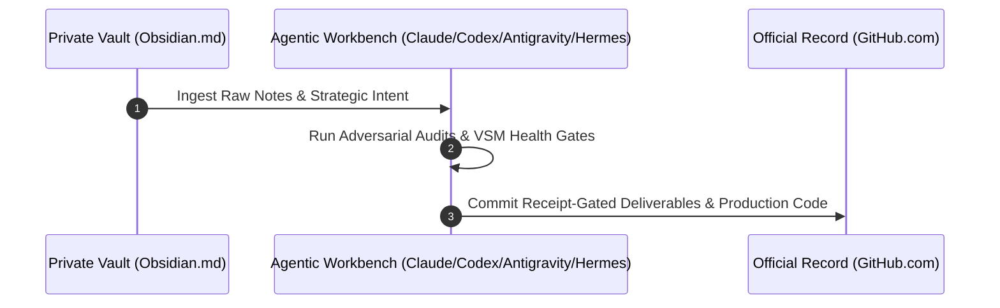

<div align="center">

# HITSUYO AKU

### FOUNDER AND SOVEREIGN IDENTITY ARCHITECT | IDENTITY FORENSICS LAB
**Operating Kernel for the GitMoney AI Office Ecosystem**

<p align="center">
  <strong>START HERE</strong><br>
  <a href="https://architect.hitsuyoaku.io">Run the diagnosis</a> &bull;
  <a href="https://github.com/GitMoneyOS/gitmoney-public-framework">See the GitMoney framework</a> &bull;
  <a href="https://github.com/GitMoneyOS/gitmoney-public-framework/blob/main/docs/proof-package/gitbuilt-qmm-proof-packet.md">Inspect a bounded proof packet</a>
</p>

<p align="center">
  <a href="#executive-indictment">Executive Indictment</a> &bull;
  <a href="#identity-forensics-lab-commercial-overview">Identity Forensics Lab</a> &bull;
  <a href="#the-gitmoney-ai-office-architecture">GitMoney Architecture</a> &bull;
  <a href="#the-viable-system-model-vsm-cybernetic-stack">VSM Cybernetics</a> &bull;
  <a href="#commercial-engagement-lanes">Service Lanes</a> &bull;
  <a href="#direct-action-channels-and-source-repositories">Source Repos</a>
</p>

<p align="center">
  <a href="https://architect.hitsuyoaku.io"></a>
  <a href="https://github.com/GitMoneyOS/gitmoney-public-framework/blob/main/docs/proof-package/gitbuilt-qmm-proof-packet.md"></a>
  <a href="https://github.com/GitMoneyOS/gitmoney-public-framework"></a>
  
  
</p>

```text
+------------------------------------------------------------------------------+
| SYSTEM IDENTIFIER : HITSUYO AKU / TEZCATLIPOCA NODE V9.0                     |
| OPERATING ENTITY  : IDENTITY FORENSICS LAB                                   |
| INFRASTRUCTURE    : GITMONEY AI OFFICE (LOCAL-FIRST CYBERNETICS)             |
| PUBLIC REPO ORG   : GITHUB.COM/GITMONEYOS                                   |
| LOCATION COORD    : ATLANTA, GA [USA]                                        |
| SYSTEM STATUS     : ONLINE // 100% SIGNAL FIDELITY // WIP <= 3               |
+------------------------------------------------------------------------------+
```

</div>

---

<a id="executive-indictment"></a>
## Executive Indictment

> **EXECUTIVE INDICTMENT ON ORGANIZATIONAL CEILINGS**  
> Most technology companies and venture-backed startups do not fail from lack of capital or market size. They stall because the founder becomes <kbd>human middleware</kbd>.  
>  
> When leadership functions as a manual routing switch for copy, code, decisions, and operational fire-fighting, the organization hits an inescapable complexity ceiling. Internal drag consumes margin, positioning dilutes, and execution degrades into noise.  
>  
> The Identity Forensics Lab solves this single point of failure. We audit organizational cybernetics, eliminate founder middleware, and install local-first, version-controlled business infrastructure powered by Stafford Beer's <kbd>Viable System Model</kbd> and the <kbd>GitMoney OS</kbd> framework.

---

<a id="identity-forensics-lab-commercial-overview"></a>
## Plain English Commercial Overview: Identity Forensics Lab

The Identity Forensics Lab (IFL) is a specialized diagnostic and system reconstruction practice. We help founders and executive teams eliminate internal operational bottlenecks and build autonomous, receipt-gated business systems.

### The Problem We Solve

As businesses scale, leadership intent gets lost between strategy and daily operations. Founders find themselves trapped in a cycle of constant oversight:

<table width="100%">
<tr>
<td width="33%" valign="top">
<h4>1. FOUNDER MIDDLEWARE</h4>
<p><b>Execution Bottleneck</b></p>
<p>The founder must personally review, edit, or approve every deliverable, slowing company execution speed to a crawl.</p>
</td>
<td width="33%" valign="top">
<h4>2. IDENTITY DRIFT</h4>
<p><b>Positioning Erosion</b></p>
<p>Core market positioning, product ethos, and brand voice dilute as teams expand or delegate tasks to raw AI tools.</p>
</td>
<td width="33%" valign="top">
<h4>3. UNCONTROLLED VARIETY</h4>
<p><b>Ashby Complexity Drag</b></p>
<p>Operational complexity outpaces management capacity, causing missed deadlines, inconsistent quality, and team burnout.</p>
</td>
</tr>
</table>

### The Commercial Solution

We conduct forensic audits of your business operations, codebases, and team workflows to identify exactly where intent breaks down. Then, we replace fragile manual management with version-controlled, receipt-gated business infrastructure.

```text
[Observed Event] -> [Forensic Signal Audit] -> [Receipt-Gated Diagnosis] -> [System Reconstruction]
```

### The 3 Core Commercial Offerings

<table width="100%">
<tr>
<td width="33%" valign="top">
<h3>The Paid Audit</h3>
<p><b>Diagnostic Sprint</b></p>
<p>A rigorous diagnostic audit of operational cybernetics. Produces a Lab Audit Record (<kbd>LAR</kbd>) detailing exact bottlenecks, signal leakage, and positioning vulnerabilities before construction is promised.</p>
</td>
<td width="33%" valign="top">
<h3>Reconstruction Build</h3>
<p><b>Forward-Deployed Build</b></p>
<p>Conditional infrastructure installation executed only when the audit proves the need. Encodes brand ethos into local markdown, agent contracts, and automated health linters.</p>
</td>
<td width="33%" valign="top">
<h3>Governance Retainer</h3>
<p><b>Monthly Continuity</b></p>
<p>Ongoing System 3/4 oversight. Provides continuous receipt verification, WIP capacity governance (<kbd>WIP &le; 3</kbd>), and automated vault health monitoring.</p>
</td>
</tr>
</table>

---

<a id="the-gitmoney-ai-office-architecture"></a>
## The 3-Tier GitMoney AI Office Architecture

GitMoney OS is governed business infrastructure engineered to turn AI-assisted work into owned, reviewable, and reusable business evidence. It decouples business growth from human fatigue using a 3-tier sovereign execution loop:

<table width="100%">
<tr>
<td width="33%" valign="top">
<h4>TIER 1: PRIVATE VAULT</h4>
<p><b>PKM Second Brain (<kbd>Obsidian.md</kbd>)</b></p>
<p>Local-first markdown private memory. Stores raw capture, private client intelligence, strategy, and personal knowledge offline on disk.</p>
</td>
<td width="33%" valign="top">
<h4>TIER 2: AGENT WORKBENCH</h4>
<p><b>Agentic Swarm Harnesses</b></p>
<p>Autonomous agent harnesses (<kbd>Claude</kbd>, <kbd>Codex</kbd>, <kbd>Antigravity</kbd>, <kbd>Hermes</kbd>) executing audits, running simulations, and compiling assets.</p>
</td>
<td width="33%" valign="top">
<h4>TIER 3: OFFICIAL RECORD</h4>
<p><b>Git Team Collaboration</b></p>
<p>Published to remote GitHub repos (<kbd>GitMoneyOS</kbd>) for team execution, client delivery, and open-source framework contribution.</p>
</td>
</tr>
</table>

### Sovereign Handoff Loop

```text
The Private Vault (Obsidian)  ->  Agentic Workbench (Harnesses)  ->  GitHub (Official Record)
Raw Memory & Intel               Local Control & Auditing          Governed Production Proof
```



### Core System Thesis

1. **Governed Infrastructure:** GitMoney is not generic AI prompts or simple workflows. It is governed business infrastructure built to convert raw AI outputs into permanent, version-controlled business assets.
2. **Strict Layer Separation:** Private memory (<kbd>Obsidian</kbd>), local agent workbenches (<kbd>Claude</kbd>, <kbd>Codex</kbd>, <kbd>Antigravity</kbd>, <kbd>Hermes</kbd>), and official business records (<kbd>GitHub</kbd>) remain distinct layers. Data graduates to GitHub only after evidence verification.
3. **Receipt-Gated Assets:** An AI output is not an asset until it possesses an owner, an approval path, verifiable evidence, a clear reuse path, and a recorded lifecycle.
4. **Empirical Verification:** Dated receipts, automated linter tests (<kbd>./mothership-doctor</kbd>), and acceptance reports outrank theoretical plans when execution choices conflict.

---

<a id="the-viable-system-model-vsm-cybernetic-stack"></a>
## The Viable System Model (VSM) Cybernetic Stack

The GitMoney AI Office integrates Stafford Beer's Viable System Model to govern all 5 organizational layers:

```text
+------------------------------------------------------------------------------+
|                             SYSTEM 5: POLICY                                 |
|           Ethos Lock, Identity Kernel, Brand Canon, and Governance           |
+------------------------------------------------------------------------------+
                                       |
+------------------------------------------------------------------------------+
|                          SYSTEM 4: INTELLIGENCE                              |
|        Market Sensing, Competitor Forensics, and Threat Detection            |
+------------------------------------------------------------------------------+
                                       |
+------------------------------------------------------------------------------+
|                             SYSTEM 3: CONTROL                                |
|        Resource Allocation, Internal Governance, and Audit Receipts          |
+------------------------------------------------------------------------------+
                                       |
+------------------------------------------------------------------------------+
|                           SYSTEM 2: COORDINATION                             |
|       Anti-Oscillation Protocols, Standards, and Ashby WIP Caps (<= 3)       |
+------------------------------------------------------------------------------+
                                       |
+------------------------------------------------------------------------------+
|                            SYSTEM 1: OPERATIONS                              |
|         Autonomous Execution, Code Generation, and Asset Delivery            |
+------------------------------------------------------------------------------+
```

<details>
<summary><b>INSPECT DEEP VSM LAYER SPECIFICATIONS (CLICK TO EXPAND)</b></summary>
<br>

| VSM Layer | Primary Responsibility | Primary Output | Gate Trigger |
| :--- | :--- | :--- | :--- |
| **System 5: Policy** | Identity Kernel and Ethos Lock | Governance Directives | Sovereign Rule Audit |
| **System 4: Intelligence** | Market Sensing and Forensic Audits | Diagnostic Briefs | Signal Leakage Check |
| **System 3: Control** | Resource Bargaining and Receipts | Audit Receipts (<kbd>LAR</kbd>) | <kbd>./mothership-doctor</kbd> |
| **System 2: Coordination** | Anti-Oscillation and Standards | Capacity Limits | <kbd>WIP &le; 3</kbd> |
| **System 1: Operations** | Primary Execution and Delivery | Production Code | <kbd>git push</kbd> |

</details>

---

<a id="commercial-engagement-lanes"></a>
## Commercial Engagement Lanes

We engage through three high-leverage commercial structures engineered for immediate operational transformation:

<table width="100%">
<tr>
<td width="33%" valign="top">
<h3>1. The Audit</h3>
<p><b>Target Vulnerability:</b> Unconscious operational bottlenecks, hidden signal leakage, and diluted founder positioning.</p>
<p><b>Deliverable:</b> A comprehensive diagnostic brief identifying exact systemic breakage points across System 1 through System 5.</p>
<p><b>Model:</b> Evidence-based diagnostic sprint.</p>
</td>
<td width="33%" valign="top">
<h3>2. Reconstruction</h3>
<p><b>Target Vulnerability:</b> Fragile manual workflows, unmanaged team friction, and lack of version-controlled business memory.</p>
<p><b>Deliverable:</b> Complete installation of the Sovereign Brand OS, custom agent contracts, and markdown pipelines.</p>
<p><b>Model:</b> Forward-deployed installation.</p>
</td>
<td width="33%" valign="top">
<h3>3. Retainer</h3>
<p><b>Target Vulnerability:</b> Operational drift, uncontrolled variety, and loss of strategic focus over time.</p>
<p><b>Deliverable:</b> Ongoing System 3/4 oversight, continuous receipt verification, and automated vault health maintenance.</p>
<p><b>Model:</b> Monthly governance retainer.</p>
</td>
</tr>
</table>

---

<a id="comparative-value-physics"></a>
## Comparative Value Physics

| Metric | Model A: Traditional Founder Middleware | Model B: GitMoney Sovereign AI Office |
| :--- | :--- | :--- |
| **Operational Bottleneck** | Founder handles every decision manually | Systems run via version-controlled contracts |
| **Execution Speed** | Linear, gated by human fatigue | Parallel, accelerated by local agent swarms |
| **Memory Persistence** | Ephemeral, lost in Slack and email | Durable, stored in git-backed local markdown |
| **Signal Fidelity** | High noise, frequent positioning drift | <kbd>100% Signal Clear</kbd>, verified by linters |
| **Capacity Control** | Unbounded chaos, chronic burnout | Strict Ashby WIP caps (<kbd>WIP &le; 3</kbd>) |

---

<a id="sovereign-operating-doctrine"></a>
## Sovereign Operating Doctrine

> **SOVEREIGN DIRECTIVE 01: PLAIN ENGLISH FIRST**  
> No corporate jargon, no theoretical posturing, and zero AI buzzwords. Every statement represents verifiable operational reality.

> **SOVEREIGN DIRECTIVE 02: EMPIRICAL RECEIPTS OVER ASSERTIONS**  
> Execution is not complete when a plan is proposed. Execution is complete when automated health checks (<kbd>./mothership-doctor</kbd>) pass with zero errors.

> **SOVEREIGN DIRECTIVE 03: DETERMINISTIC CAPACITY LIMITS**  
> We enforce strict capacity caps (<kbd>WIP &le; 3</kbd>) to guarantee maximum execution depth and 9-figure precision on every deliverable.

---

<a id="direct-action-channels-and-source-repositories"></a>
## Direct Action Channels and Source Repositories

To initiate an audit, inspect source code, or review public framework documentation:

* **Primary Portal:** [architect.hitsuyoaku.io](https://architect.hitsuyoaku.io)
* **Lab Practice:** Identity Forensics Lab
* **GitMoney OS Organization:** [github.com/GitMoneyOS](https://github.com/GitMoneyOS)
* **Public Framework Source:** [github.com/GitMoneyOS/gitmoney-public-framework](https://github.com/GitMoneyOS/gitmoney-public-framework)
* **Personal Repository Archive:** [github.com/HitsuyoAkuWeb3](https://github.com/HitsuyoAkuWeb3)

---

<div align="center">

```text
================================================================================
          HITSUYO AKU // IDENTITY FORENSICS LAB // GITMONEY OS 2026
================================================================================
```

[Back to Top](#hitsuyo-aku)

</div>
